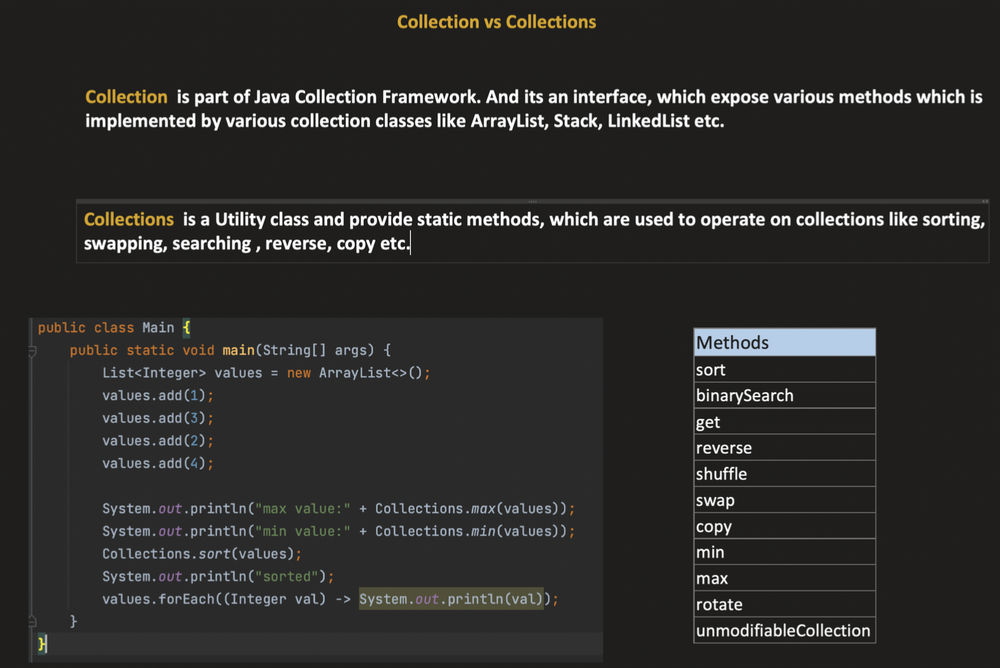
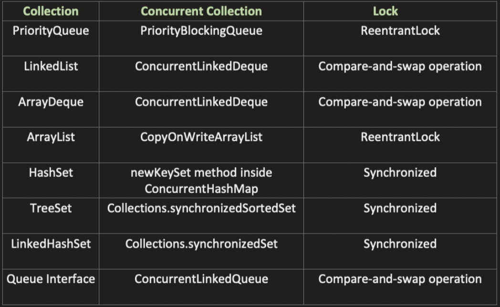
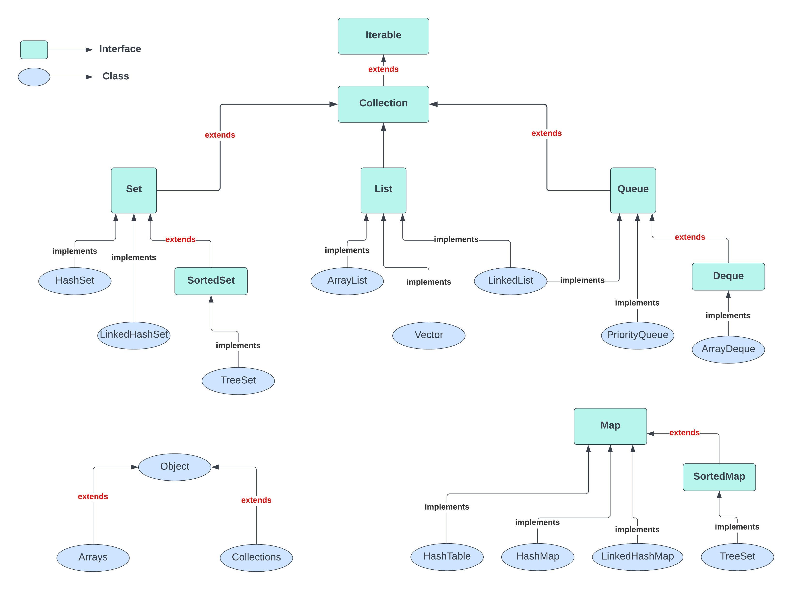
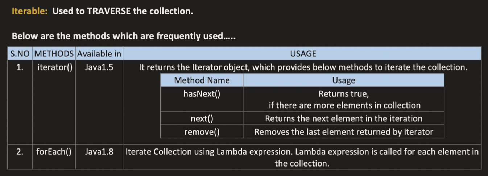
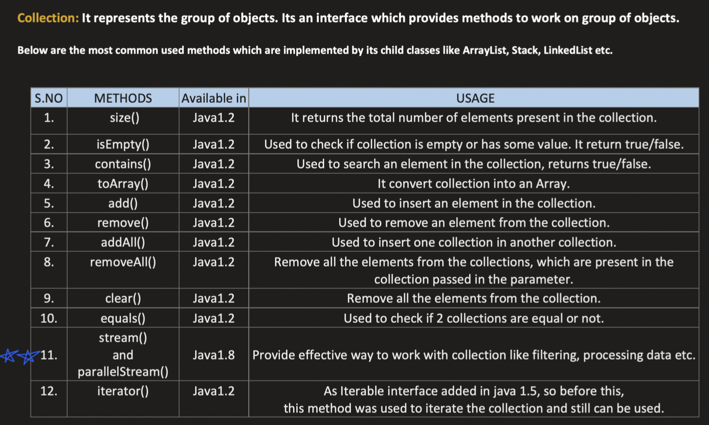

### Collections V/S Collection
------------------------------

------------------------

>>>>>>>>>>>>>>>>>>>>>>>>

# Collection Framework
------------------------

- `Group of objects` present in `java.util` package.
- Prior to collection framework we were having Arrays, Vector, HashTables but the problem was that we were not having common interface and it was difficult to remember different methods of those.

----------------------

----------------------

### Iterable
------------
- Iterable is the parent of the collection interface.
- It is used to traverse the collection.

------------------------

------------------------

>>>>>>>>>>>>>>>>>>>>>>>>

### Collection
--------------
- Collection extends Iterable.
- It has various child's like LIST, SET, QUEUE.

------------------------

------------------------

- `(Comparable)` Ordering coming from the classes itself is called as -> `Natural Ordering`
- `(Comparator)` Ordering given from the Custom implementation is called as -> `Total Ordering`
- Precedence: `Total Ordering > Natural Ordering`

## Comparable
- Comparable interface should be implemented by the class itself.
- It has compareTo(Object obj) method with one argument as the class implementing this interface has its own object to compare with.

## Comparator
- Comparator interface should be implemented by the Comparator class itself.
