## Exception Handling concepts
------------------------------

- It is an event which disrupts the normal flow a program.
- Runtime system creates an Exception Object which contains information such as:
    - type of excpetion and message
    - stack trace etc
- Runtime system uses this Exception Object and finds the class that can handle it

- Below is the example that explains how the runtime system on getting the exception creates the exception object internally and looks for the class than can handle it. The flow starts from the `main` method itself.

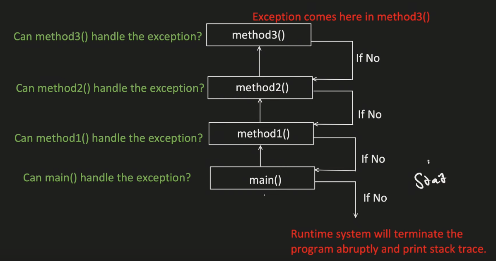

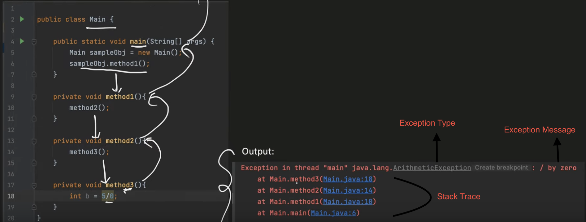

----------------------
----------------------
## Exception Hierarchy
----------------------

- Object is the topmost class/parent class in whole java world.
- Error is a type of runtime exception or unchecked exception as it occurs while you run the program.

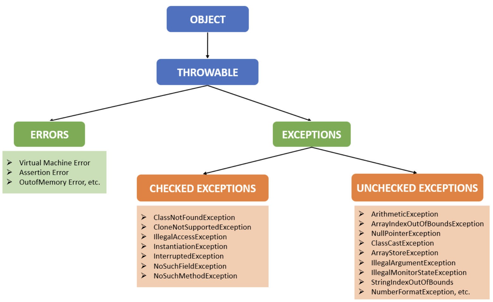

------------------------

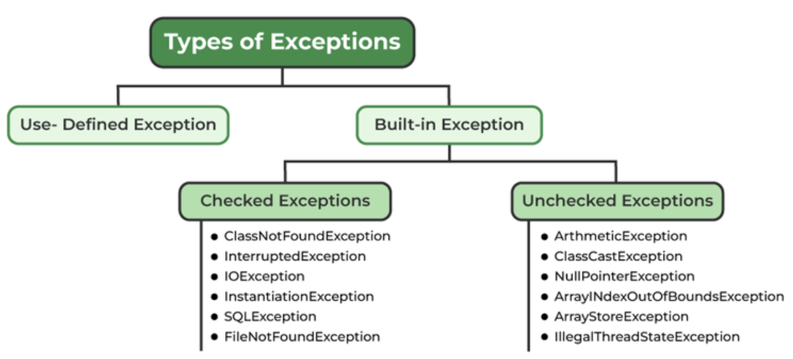

------------------------

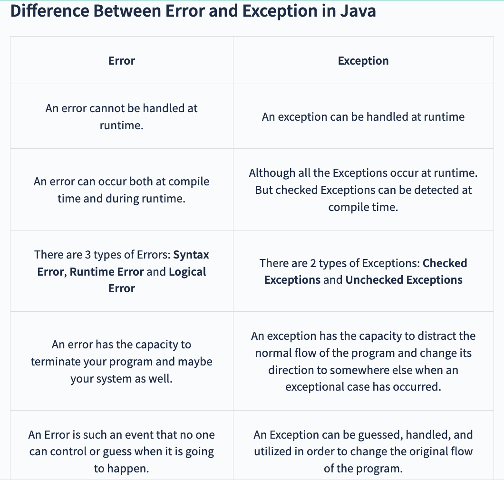

------------------------

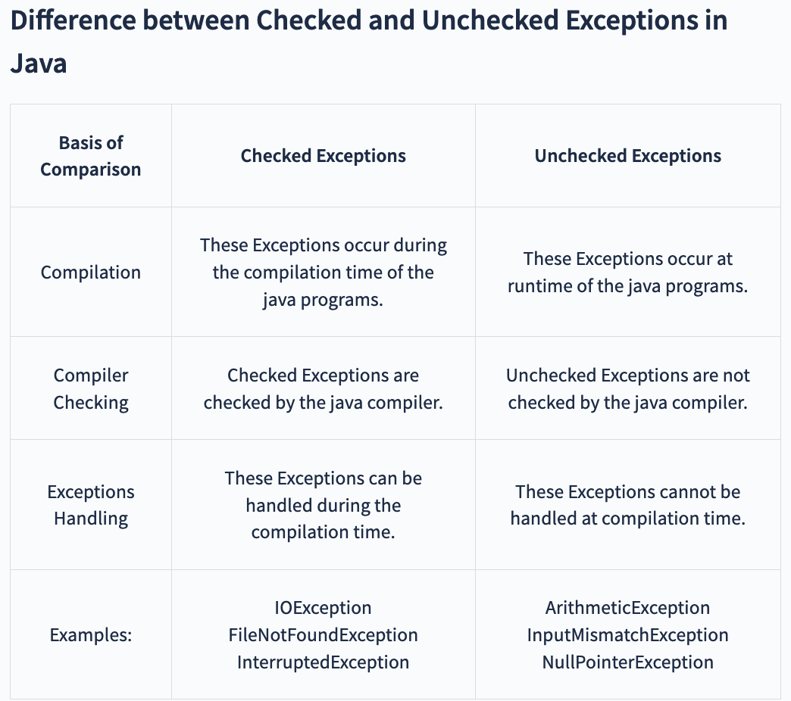

------------------------

- Checked exception is something you need to handle compulsory else your code will not evern compile and will fail.

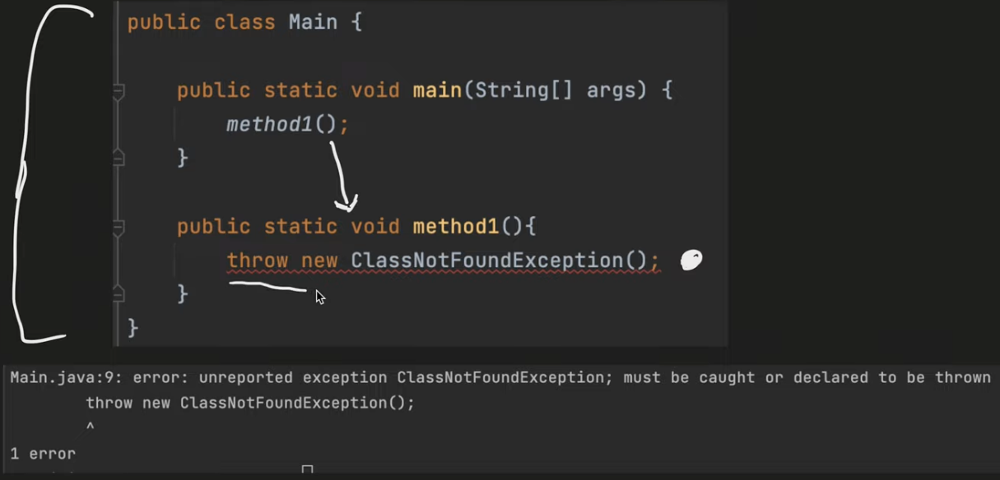

------------------------

-  Now we will try to handle this checked exception by delegating the exception to caller as below:

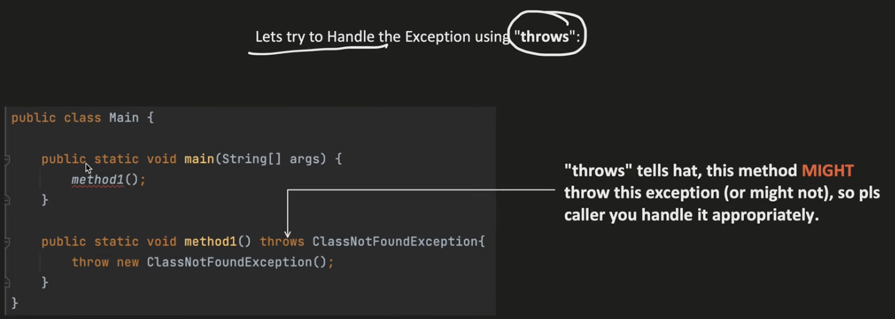

------------------------

- Now finally we will see how to actually handle the exception below:

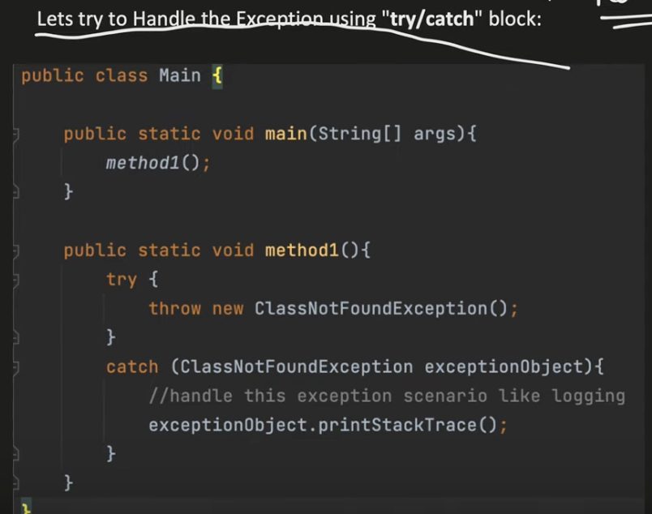

----------------------
----------------------
## Ways of Handling exception using try, catch, finally, throws, throw
----------------------------------------------------------------------

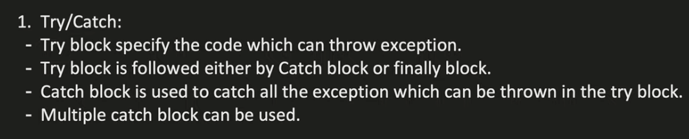

- catch block can only catch those exception which can be thrown by the try block

-----------------------

> To catch all exceptions that might occur you need to use parent exception.

- **** While using parent exception make sure that it is the last catch block(mandatory) i.e. all the child exceptions must be placed before using parent exception catch block.

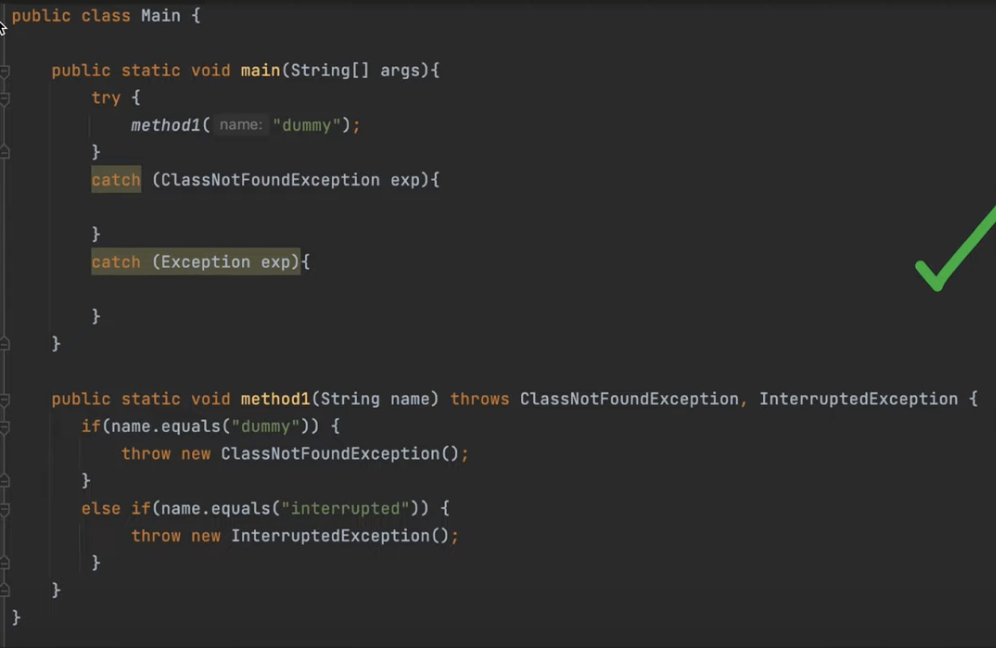

------------------------

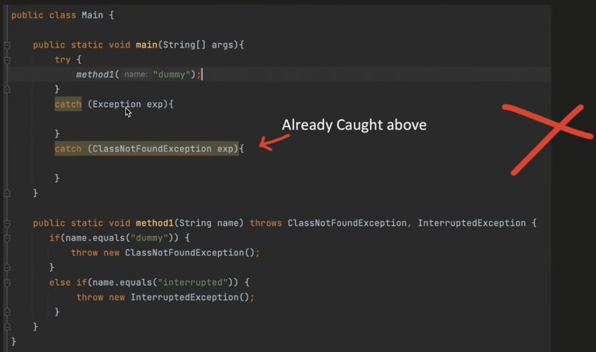

------------------------

> To catch multiple exceptions in one catch block use below:

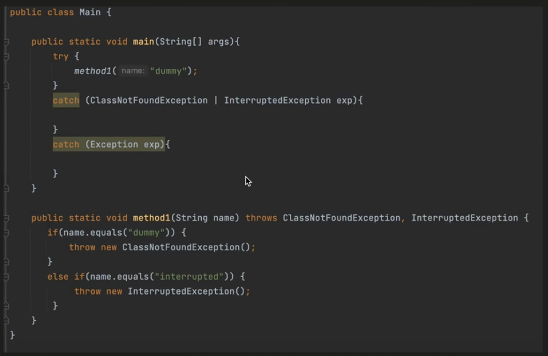

-------------------------

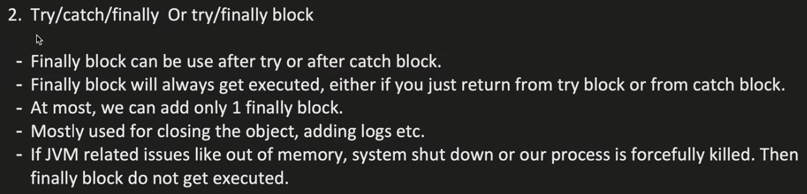

------------------------

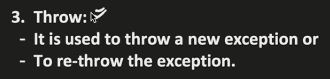

------------------------

> To create your own custom exceptions either checked/unchecked below is the way to achieve that:

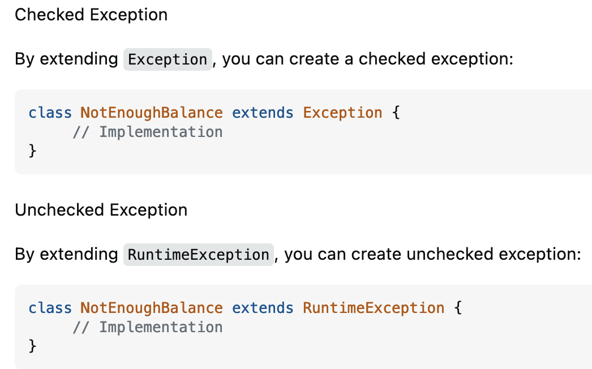

------------------------
------------------------

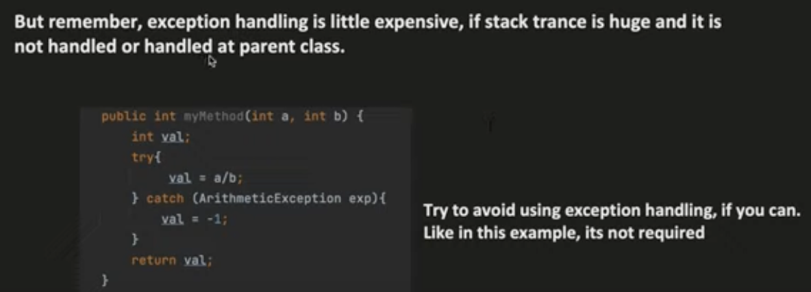

