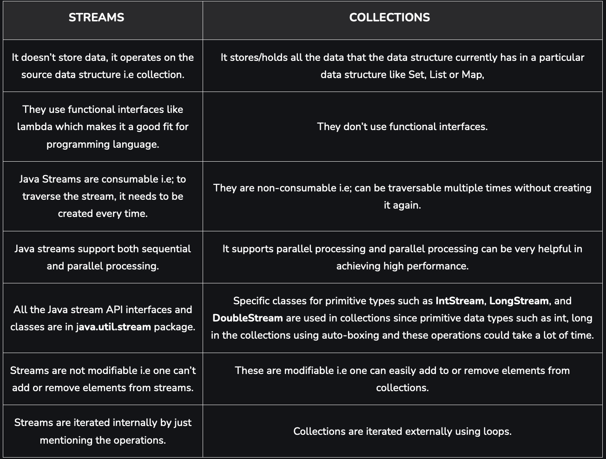
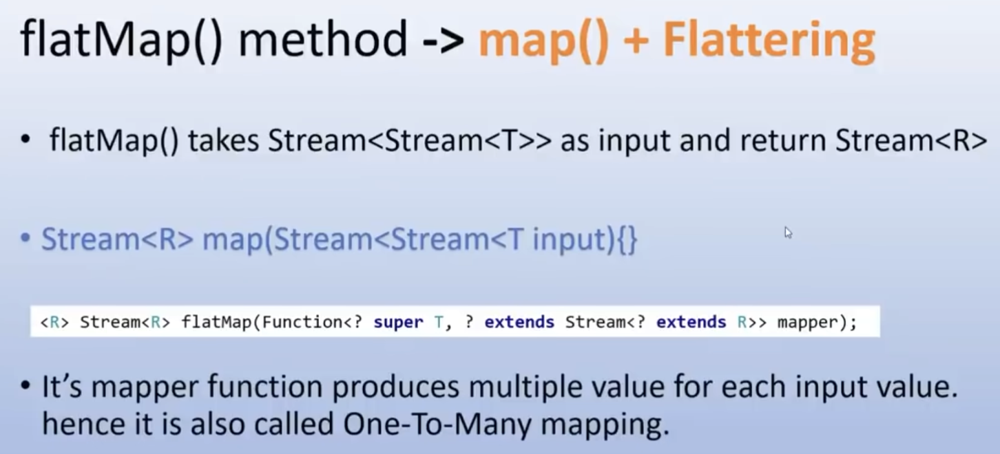
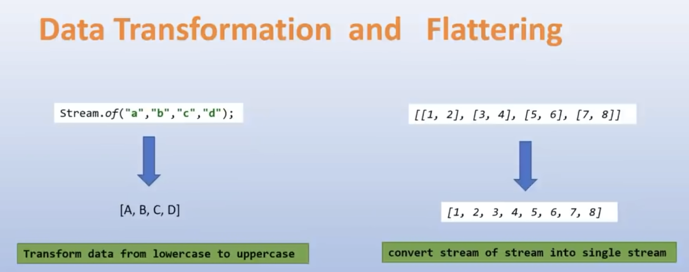
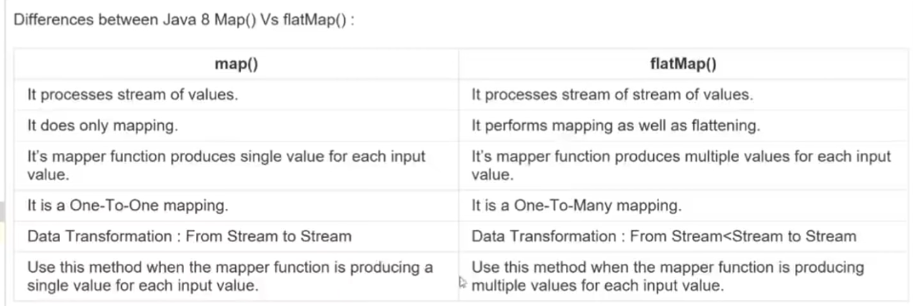
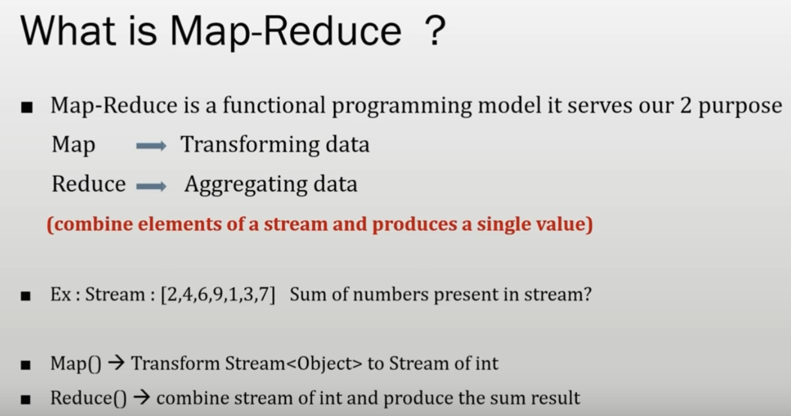
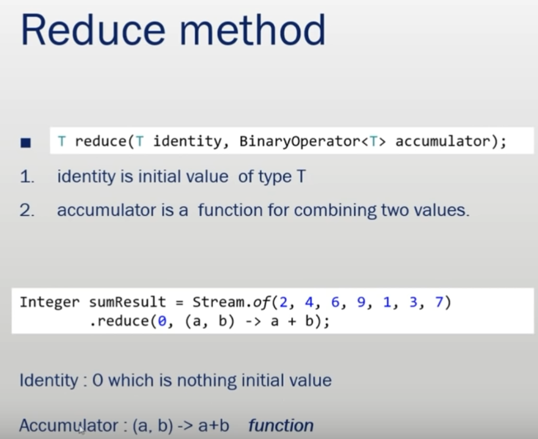
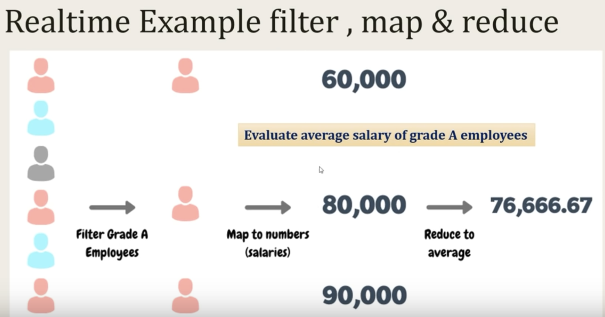
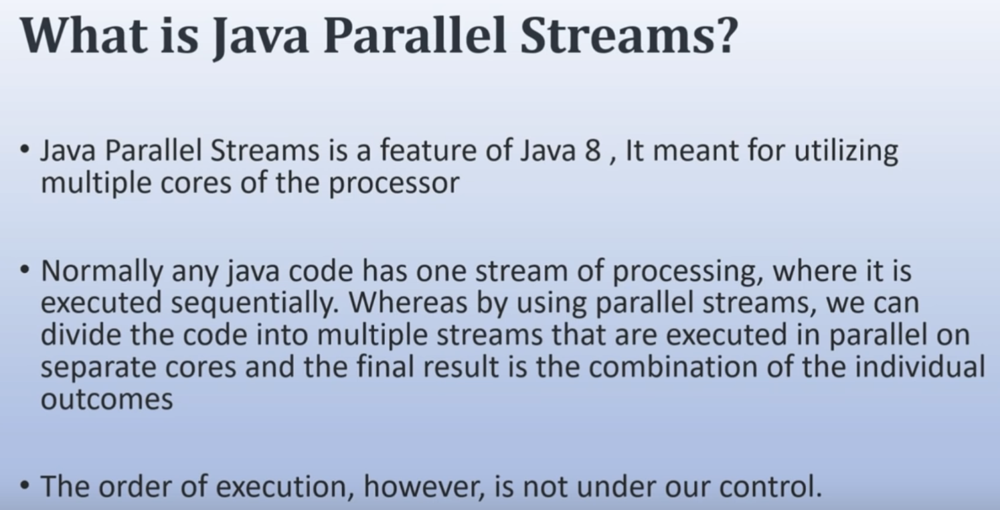
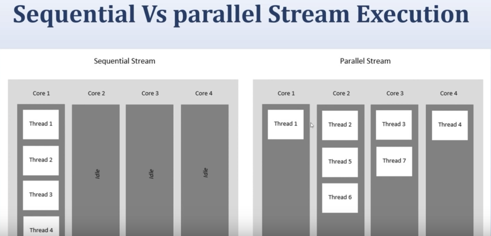

## Lambda Expression
- Used to represent anonymous functions(method which don't have any name or modifier).
- Syntax: Parameter Expression  Body;
Ex.:- `() ->  {method_body};`
- **NOTE:- If you have only one line logic than you don't need {} these braces in method body. But incase you have multiple lines of code than its mandatory to use {} these.
- Methods present in functional interface can only be written using Lambda expressions.

##  Functional Interface
- Interface which contains only one abstract method but can have multiple default and static method.
- For ex:- Runnable ->  run(), Callable ->  call(), Comparable  ->  compareTo(), Comparator ->  compare()
- If you want to create your own functional interface annotate your interface with @FunctionalInterface.

## Consumer
- A Consumer is an in-build functional interface in the java.util.function package. we use consumers when we need to consume objects, the consumer takes an input value and returns nothing. The consumer interface has two methods.
`void accept(T value);`
`default Consumer<T> andThen(Consumer<? super T> after);`

- forEach method in streams uses consumer to do nothing with the input and let the logic perform what it has to do

## Predicate
- A Predicate is a functional interface, which accepts an argument and returns a boolean. 
- It is basically used for conditional checks i.e. functions that returns either true/false.
- Usually, it is used to apply in a filter for a collection of objects.
`boolena test(T t);`

- filter method in streams uses predicate to do the conditional check internally

## Supplier
- It represents a function that does not take in any argument but produces a value of type T. It contains only one method.
`T get();`
- orElseGet method in streams uses supplier to take nothing and return something.

## Function
- Represents a function that accepts one argument and produces a result.
`R apply(T t);`

## Method Reference in Lambdas
- Use ClassName::static method form to increase readability and write less code
- For ex:- List<Integer> arrList = Arrays.asList(1, 2, 3, 4, 5, 6, 7, 8);
arrList.stream().forEach(System.out::println);
arrList.stream().mapToInt(String::length).forEach(System.out::println);
- List<String> arrList1 = Arrays.asList("hi", "bye", "hello", "vivek", "pandey");
arrList1.sort(String::compareToIgnoreCase);

## Difference between Stream and Collections

## Streams
- Used to process collection of objects.
- Stream is not a data structure instead it takes input from Collections, Arrays and I/O channels.
- Streams doesn't change the original data structures instead it just gives out the result based on the pipelined methods.

`Operations performed`:
- mapping       -> convert one type into other
- filtering     -> remove some objects according to condition applied
- flattening    -> converts into single streams from various other streams

`Intermediate Operations`:
- stateless     -> do not need a buffer to work. Ex.- map(), filter(), flatMap()
- stateful      -> needs buffer to work. Ex.- sorted(), distinct()
- ordering      -> needs to have order of elements by tracking their indexes. Ex.- limit(), skip()

`Terminal Operations`:
This operations is responsible for triggering of consuming data from the data sources.
- Methods that will consume all the data from stream
    - forEach(), max(), min(), count(), reduce(), toArray()

- Methods that do not need to consume all the data from stream
    - allMatch(), anyMatch(), findAny(), findFirst(), noneMatch()

`Methods`:
- filter()  -> used for conditiona check just like if-else.
- forEach() -> used for interation just like loops.
- sorted()  -> use for sorting collections based on different ordering(including custom comparators)
- collect() -> use for collecting processed streams.
- map()     -> Immediate methods used to return another stream. Used for transformation. 

- flatMap() -> Immediate methods used to return another stream from stream of streams. Used for transformation and flattering. flatMap = map() + flattering.

- reduce() -> Used to aggregate data i.e. combining multiple streams and returning single output.
            average(), sum(), min(), max(), and count()

- skip()

- limit()

- count()

- distinct()

- Collectors() 
Performs 4 basic operations : Supply, Accumulate, Combine, Finisher

- groupingBy()
Groups the result based on some key and value and returns the Map.

- partioningBy()

- joining()

## Optional
- It is used to avoid unpredictable NULL_POINTER_EXCEPTIONS.
- It is a public final class.
- It may or may not contain non-null values.
- If a value is present than isPresent() returns true, and get() will return the value.
- If a value is not present a default value is returned.

`Methods`:
- of()          -> use if you are sure that whatever you are passing will not be null ele it throws NPE
- ofNullable()  -> use if you are not sure that whatever you are passing can contain null.
- empty()       -> to return empty() Optional object
- isPresent()   -> to check if element is present in the Optional
- get()         -> to get the actual value from the Optional object
- orElse()      -> use if you want to return something if queried request is not fulfilled
- orElseGet()   -> use if you want to return something from the Optional if queried request is not fulfilled
- orElseThrow() -> use if you want to throw something if queries request is not fulfilled

## Parallel Streams

