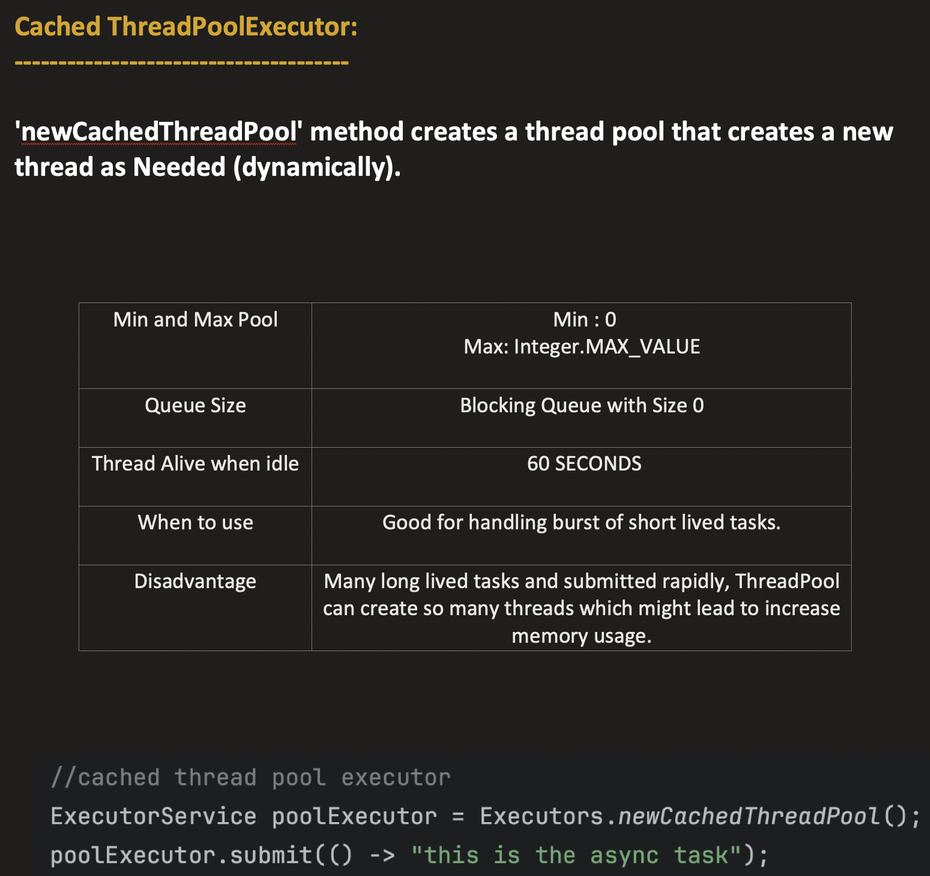
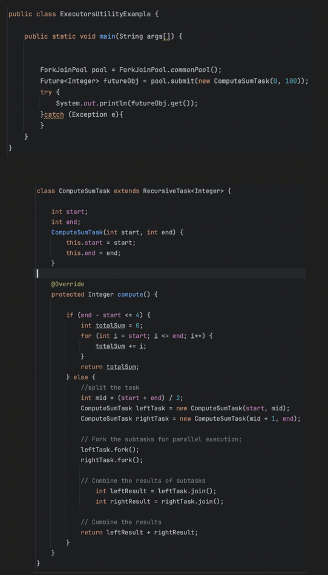

## MultiTasking v/s MultiThreading
----------------------------------

- In multitasking no resources are shared, they work separately but in mutlithreading resources are being shared so that they can work parallely.

>>>>>>>>>>>>>>>>>

## MultiThreading and its benefits/challenges
----------------------------------------------

>>>>>>>>>>>>>>>>>>

### Process
-----------

>>>>>>>>>>>>>>>>>>

### Thread
----------

>>>>>>>>>>>>>>>>>>>

### Working of Process and Thread together
-------------------------------------------

>>>>>>>>>>>>>>>>>>>>>>>>

## Basics of Thread
-------------------

- ### Ways of creating Thread
  ---------------------------  

>>>>>>>>>>>>>>>>>>>>>>>>>

- ### Thread lifecycle
  --------------------

>>>>>>>>>>>>>>>>>>>>>>>>>

- ### Monitor Lock
------------------

>>>>>>>>>>>>>>>>>>>>>>>>>

## Locks and Semaphores
-----------------------

- Locking does not depend on Objects as like synchronize method.

- We have await() [same as wait()]  and signal() [same as notify()] method for working with different kinds of locks in inter-thread communication.

>>>>>>>>>>>>>>>>>>>>>>>>>

## Ways of achieving Concurrency/MultiThreading
-----------------------------------------------

- ### CAS & FAA
---------------

- - ### ABA Problem with CAS
----------------------------

- #### Exapmle and problem

- To demonstrate the problem via a practical example, let’s consider a simple bank account class, where an integer variable holds the amount of the actual balance. We also have two functions: one for withdrawals and one for deposits. These operations use CAS to decrease and increase the balance of the account.

- Let’s think about a multithreaded scenario when Thread 1 and Thread 2 are operating on the same bank account. When Thread 1 wants to withdraw some money, it reads the actual balance to use that value for comparing the amount in the CAS operation later. However, for some reason, Thread 1 is a bit slow — maybe it’s blocked.

In the meantime, Thread 2 performs two operations on the account using the same mechanism while Thread 1 is suspended. First, it changes the original value, which has already been read by Thread 1, but then, it changes it back to the original value.

Once Thread 1 resumes, it will appear as if nothing has changed, and CAS will succeed:

- ### Atomic
------------

- When there is a use case of Read-Write-Modify lock free concurrency can be used.

### Volatile
------------

>>>>>>>>>>>>>>>>>>>>>>>>>

## Thread Pools and ThreadPoolExecutor
--------------------------------------

- Comes from `package java.util.concurrent`

------------------------

------------------------

## Future
---------

>>>>>>>>>>>>>>>>>>>>>>>>>

## CompletableFuture
--------------------

>>>>>>>>>>>>>>>>>>>>>>>>>

## Callable
-----------

>>>>>>>>>>>>>>>>>>>>>>>>>

## Fork/Join Pool, Single, Fixed, CachedPool
--------------------------------------------

