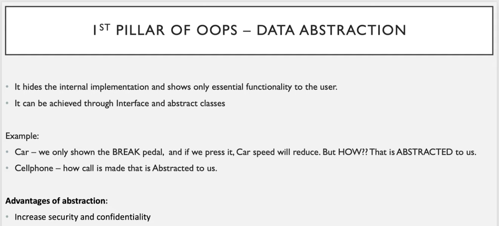
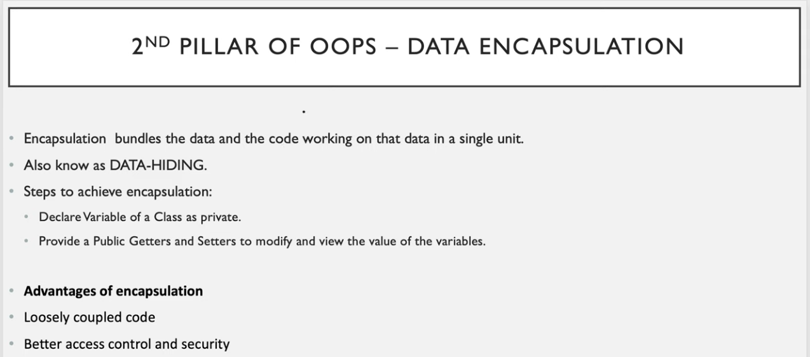
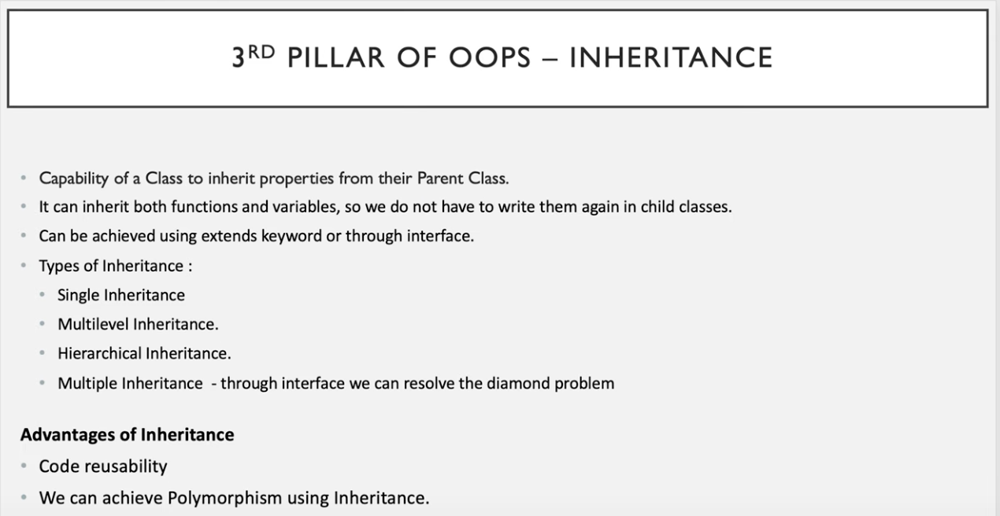
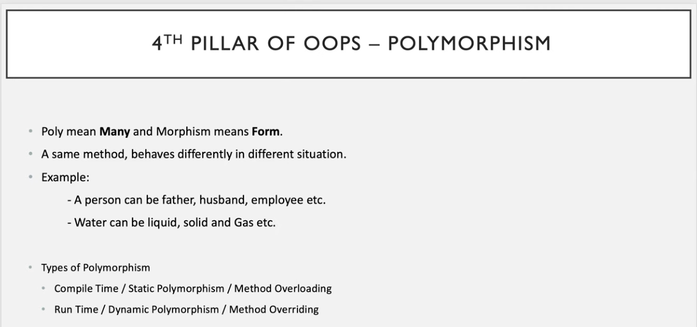
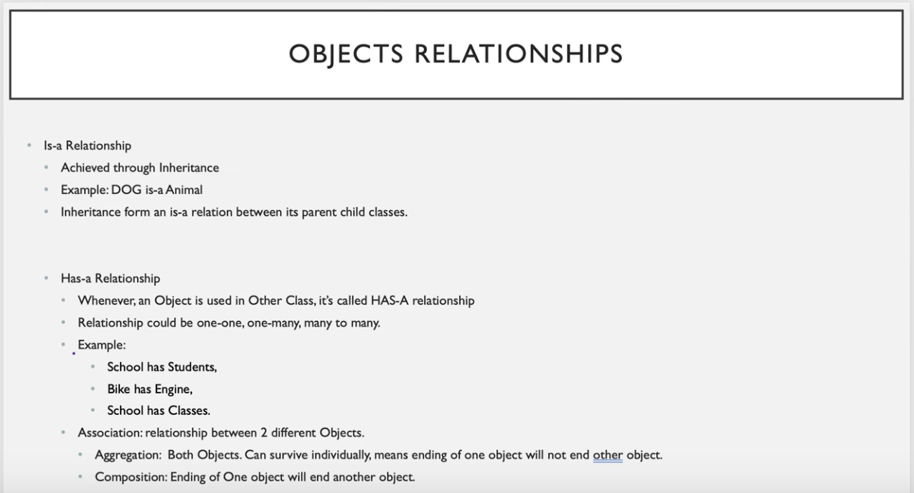

## OOPS CONCEPTS

- `Objects`: Is a real world entity which consists of 2 things (Properties/State && Behaviour/Function)
    - For ex: ------`Dog`------
        - `Properties`: Breed, Colour, Size, Weight etc.
        -  `Behaviour`: Bark, Sleep, Eat etc.
                    
- `Classes`: It provides a template or blueprint from which objects can be created.
    - To create an object, a class is required
    - Using 1 class we can create multiple objects
    - Class can be created using `class` keyword

- Variables declared inside class are known as `data members` which defines properites of an object.
- Functions/methods defined inside class are known as `member functions` which tells about the behaviour of an object.

## 4 Pillars of OOPS

## Object Relationship

##
##
##
##

## Working of JAVA program

- JVM calls the main method() which is the starting point of all the java program's.

- `public static void main (String args[])` -->> public means can be called from anywhere, static means it doesn't require object creation but can be called using CLASS NAME, void means it will return nothing, main() is the method which is called by JVM using CLASS NAME. 

- 1 java file can have only 1 public class.

- public class name and filename must be same.

- WORA(Write Once Run Anywhere) that's why portable

- Java program is platform independent

- But JVM, JRE, JDK are all platform dependent

- JVM has `Just-In-Time Compiler` which converts bytecode into machine code.

> `Java Program`(.java file) -->> [Compiler] -->> `ByteCode`(.class file) -->> [JVM] -->> `Machine Code` -->> CPU -->> RESULT

- JRE (Java Runtime Environment) -->> `JVM + Class Libraries` (any sort of java libraries used in the program, JRE helps JVM to create the linkage for generating the accurate bytecode)

- JDK (Java Development Kit) -->> `JRE + [Programming Language + Compiler + Debugger]`

